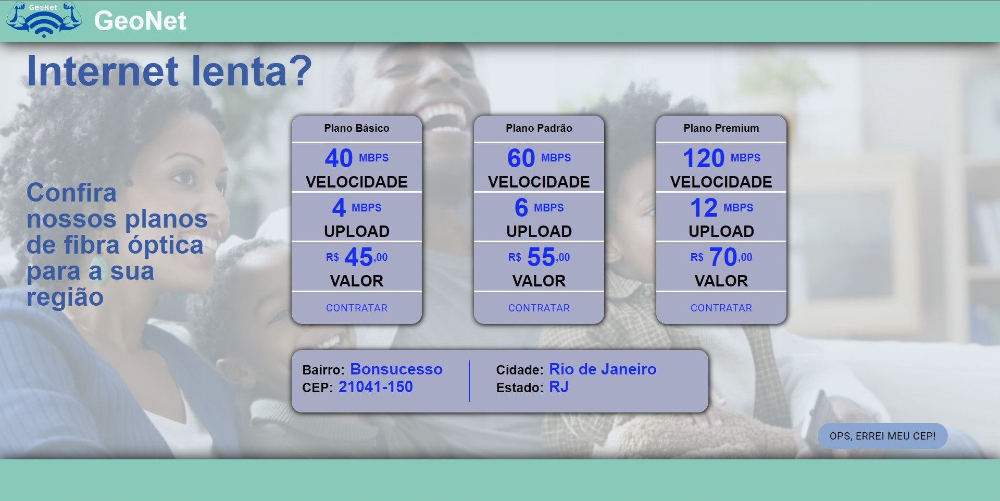

# Omnix-challenge
## Desafio técnico da empresa Omnix.

### Progresso do projeto: Projeto terminado dentro do prazo.

### - Fiquem à vontade para ver o código e sugerir correções, melhorias ou dar conselhos sobre qualquer coisa. Todo aprendizado é bem vindo.

### Link para testar online: https://omnix-challenge-patrick-otero.netlify.app/

### Assim que entrar no site, o campo para inserir o CEP aparecerá. Apenas insira um CEP válido.

### Se quiser testar localmente:

         1° - Baixe a engine (motor) que interpretará as funcionalidades das dependências em javascript, o Node, através deste link: https://nodejs.org/en/download/
         2° - Selecione o instalador de acordo com o seu sistema operacional e arquitetura (32-bit ou 64-bit)
         3° - Ao abrir o instalador do Node, pressione o botão "next" até o final.
         4° - Clone este repositório para o seu computador, vá até a pasta clonada e execute seu terminal na mesma.
         5° - Execute o comando no diretório raíz (onde está localizada a pasta "src"): "npm i".
         6° - Espere o interpretador instalar todos os arquivos necessários para rodar o projeto.
         7° - Execute o comando no mesmo local: "npm start"
         8° - Aguarde a abertura do projeto em seu navegador padrão.

## Tecnologias que foram exigidas no projeto:

        - HTML (obrigatório)
        - CSS (obrigatório)
        - JAVASCRIPT (obrigatório)
        - React (extra)
        - Context-api (extra)
        
## Tecnologias que usei até agora:

        - Typescript
        - React
        - Material-ui
        - Styled components
        - React-router-dom
        - React-use
        - Axios
        - Context-api

## Tela home

## Tela de planos

# Obrigado Omnix pela oportunidade que me deu.
